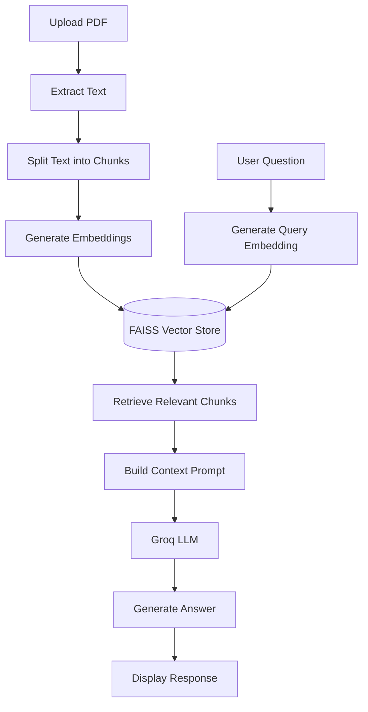

# 🤖 DocuMind AI

### AI-Powered PDF Chatbot using Retrieval-Augmented Generation (RAG)

> **Upload a PDF → Ask questions → Get intelligent, context-grounded answers**

DocuMind AI is a full-stack **AI-powered document intelligence application** that allows users to upload PDF documents and interact with them using natural language.

The application uses **Retrieval-Augmented Generation (RAG)** to retrieve relevant information from uploaded documents before generating answers with an LLM. This helps keep responses grounded in the actual document content instead of relying only on the model's general knowledge.

---

## 🚀 Live Demo

🔗 **Live Demo:** Coming Soon

🔗 **GitHub:**
https://github.com/tannukri01/Pdf-Chatbot

---

## 🎯 Problem Statement

Searching through large PDF documents manually can be time-consuming and inefficient.

DocuMind AI provides a conversational interface where users can simply ask questions about their documents and receive relevant answers based on the uploaded content.

### Example

**User uploads:** Resume.pdf

**User asks:**

> "What technical skills are mentioned in the resume?"

**DocuMind AI retrieves the relevant sections and generates an answer using the document context.**

---

## ✨ Features

* 📄 Upload PDF documents
* 📚 Support for multiple PDF documents
* 🔍 Semantic search using vector embeddings
* 🧠 Retrieval-Augmented Generation (RAG)
* ⚡ Fast LLM inference using Groq
* 🤖 Context-aware document question answering
* 🗂️ FAISS-based vector search
* 🌐 FastAPI REST backend
* 💻 Responsive web interface
* 🔐 Environment-based API key configuration
* 🆓 Uses free/open-source AI components

---

## 🧠 How RAG Works



### RAG Pipeline

```text
PDF Document
     ↓
Text Extraction
     ↓
Text Chunking
     ↓
HuggingFace Embeddings
     ↓
FAISS Vector Store
     ↓
User Query
     ↓
Semantic Similarity Search
     ↓
Relevant Context
     ↓
Groq LLM
     ↓
Final Answer
```

---

## 🏗️ System Architecture

### 1. Document Ingestion

```text
PDF
 ↓
Document Loader
 ↓
Text Extraction
 ↓
Text Splitting
 ↓
Embedding Generation
 ↓
FAISS Vector Store
```

### 2. Question Answering

```text
User Question
 ↓
Query Embedding
 ↓
FAISS Similarity Search
 ↓
Relevant Document Chunks
 ↓
Context + Question
 ↓
Groq LLM
 ↓
AI Generated Answer
```

---

## 🛠️ Tech Stack

### Frontend

* HTML5
* Tailwind CSS
* Vanilla JavaScript

### Backend

* Python
* FastAPI
* Uvicorn

### AI / Machine Learning

* LangChain
* HuggingFace Embeddings
* `all-MiniLM-L6-v2`
* FAISS
* Groq LLM

### Development Tools

* Git
* GitHub
* Python Virtual Environment
* REST APIs

---

## 🔥 Key Technical Highlights

### 🔹 Retrieval-Augmented Generation

Implemented an end-to-end RAG pipeline that retrieves relevant document context before sending information to the LLM.

### 🔹 Semantic Search

User questions are converted into vector embeddings and compared with document embeddings to retrieve semantically relevant content.

### 🔹 Vector Search with FAISS

FAISS is used as the vector store for efficient similarity-based document retrieval.

### 🔹 HuggingFace Embeddings

The project uses:

```text
sentence-transformers/all-MiniLM-L6-v2
```

This lightweight embedding model allows semantic search without depending on a paid embedding API.

### 🔹 Groq LLM Integration

Groq is used for fast LLM inference and natural-language response generation.

### 🔹 FastAPI Backend

FastAPI provides the backend REST APIs responsible for:

* PDF upload
* Document processing
* Embedding generation
* Vector retrieval
* RAG pipeline execution
* LLM response generation
* CORS handling

---

## 📂 Project Structure

```text
Pdf-Chatbot/
│
├── backend/
│   ├── main.py
│   ├── requirements.txt
│   └── .env.example
│
├── frontend/
│   └── index.html
│
├── .gitignore
└── README.md
```

> ⚠️ The actual `.env` file should never be committed to GitHub.

---

# ⚙️ Installation & Setup

## 1️⃣ Clone the Repository

```bash
git clone https://github.com/tannukri01/Pdf-Chatbot.git
cd Pdf-Chatbot
```

---

## 2️⃣ Create Virtual Environment

```bash
cd backend

python -m venv venv
```

---

## 3️⃣ Activate Virtual Environment

### Windows

```bash
venv\Scripts\activate
```

### macOS / Linux

```bash
source venv/bin/activate
```

---

## 4️⃣ Install Dependencies

```bash
pip install -r requirements.txt
```

---

## 5️⃣ Configure Environment Variables

Create a `.env` file inside the `backend` directory:

```env
GROQ_API_KEY=your_groq_api_key
```

> 🔐 Never upload your API key to GitHub.

---

## 6️⃣ Start the Backend

```bash
uvicorn main:app --reload --port 8000
```

Backend will run at:

```text
http://localhost:8000
```

---

## 7️⃣ Start the Frontend

Open another terminal:

```bash
cd frontend

python -m http.server 5500
```

Open the application:

```text
http://localhost:5500
```

---

# 🔌 API Overview

> The endpoint names below should match the routes implemented in `backend/main.py`.

### Upload Document

```http
POST /upload
```

Uploads and processes the PDF document for semantic retrieval.

### Ask Question

```http
POST /ask
```

Accepts a natural-language question and generates an answer using retrieved document context.

### Example Request

```json
{
  "question": "What are the main skills mentioned in this resume?"
}
```

### Example Response

```json
{
  "answer": "The resume mentions Java, Python, React, FastAPI and SQL."
}
```

---

# 🖥️ Application Flow

```text
1. User uploads a PDF
            ↓
2. PDF text is extracted
            ↓
3. Text is divided into chunks
            ↓
4. Chunks are converted into embeddings
            ↓
5. Embeddings are stored in FAISS
            ↓
6. User asks a question
            ↓
7. Question is converted into an embedding
            ↓
8. Relevant document chunks are retrieved
            ↓
9. Retrieved context is sent to Groq LLM
            ↓
10. Context-grounded answer is displayed
```

---

# 📸 Screenshots

Add real screenshots of the application here.

Recommended screenshots:

### 📄 PDF Upload

```text
docs/
└── upload-screen.png
```

```markdown

```

### 💬 Chat Interface

```text
docs/
└── chat-screen.png
```

```markdown

```

### 🤖 AI Response

```text
docs/
└── result-screen.png
```

```markdown

```

> **Recruiter tip:** Add 2–3 clean screenshots showing the actual working application.

---

# 🎯 Real-World Use Cases

DocuMind AI can be used for:

* 📄 Resume analysis
* 📚 Study material
* 🎓 Academic notes
* 🏢 Company reports
* 📑 Research papers
* 📋 Policy documents
* 📊 Business reports
* 🧾 Internal documentation
* ⚖️ Document-based knowledge systems

---

# 💡 Key Learnings

This project provided hands-on experience with:

* End-to-end RAG architecture
* PDF document processing
* Text extraction
* Text chunking
* Vector embeddings
* Semantic similarity search
* FAISS vector stores
* LangChain
* LLM integration
* Prompt construction
* FastAPI REST APIs
* File upload handling
* CORS configuration
* Frontend-backend integration
* Environment variable management
* Git and GitHub

---

# 🚧 Current Limitations

* Currently optimized mainly for text-based PDFs
* Vector data is not permanently persisted
* No user authentication
* Chat history is not permanently stored
* Large documents may require further retrieval optimization

---

# 🔮 Future Improvements

* [ ] Persistent vector database
* [ ] Chat history
* [ ] User authentication
* [ ] Multi-user document isolation
* [ ] DOCX support
* [ ] TXT support
* [ ] Streaming responses
* [ ] Source citations for retrieved content
* [ ] Conversation memory
* [ ] Cloud deployment
* [ ] RAG evaluation metrics
* [ ] Document-level access control

---

# 📊 Future RAG Evaluation

Future versions can evaluate the system using metrics such as:

```text
Retrieval Accuracy
Context Relevance
Answer Relevance
Faithfulness
Response Latency
```

These evaluations can help measure the quality and reliability of the RAG pipeline.

---

# 🔐 Security

* API keys are stored using environment variables.
* `.env` is excluded from version control.
* Uploaded files should be validated before processing.
* Production deployments should include authentication.
* Production systems should implement document-level authorization.

---

# ⭐ Project Highlights

```text
✔ End-to-End RAG Application
✔ Semantic PDF Search
✔ HuggingFace Embeddings
✔ FAISS Vector Retrieval
✔ Groq LLM Integration
✔ LangChain
✔ FastAPI REST Backend
✔ Responsive Frontend
✔ Free/Open-Source AI Stack
✔ Real-World Document Intelligence Use Case
```

---

# 👩‍💻 Author

## Tannu Kumari

**MCA | Full Stack Developer | AI/RAG Enthusiast**

### Connect with me

* 💻 GitHub: https://github.com/tannukri01
* 🔗 LinkedIn: https://www.linkedin.com/in/tannu-kumariofficial

---

# 📌 Project Summary

**DocuMind AI demonstrates how modern AI technologies can be combined with full-stack development to build a practical document-intelligence system.**

The project combines:

```text
Full-Stack Development
        +
Vector Search
        +
Embeddings
        +
RAG
        +
Large Language Models
```

to create an application that allows users to **interact with PDF documents using natural language.**

---

## ⭐ Support

If you find this project useful, consider giving the repository a ⭐ on GitHub.
